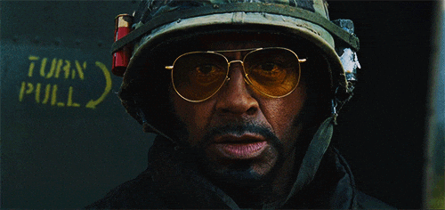

<p align="center">
  
</p>

---

# Minesweeper Game from Docker Image

### Preqequisites

### Docker Image

You can access to the graphical Minesweeper game with the **docker** [image](https://hub.docker.com/repository/docker/yanncauchepin/wxminesweeper/general).

```sh
docker pull yanncauchepin/wxminesweeper:latest
```

## Usage

1. The command

```bash
xhost +local:root
```

tells your X server to allow any process running as the local root user (or any local process running with root privileges) to connect and interact with your display. This is useful in containerized environments where your container runs as root and needs to display GUI output on your host.

2. Run the following command to launch the graphical minesweeper through the downloaded docker image.
```bash
sudo docker run -e DISPLAY=$DISPLAY -v /tmp/.X11-unix:/tmp/.X11-unix yanncauchepin/wxminesweeper
```


3. After you no longer need to allow local root access, you can restore the previous state of your X server's access control. Run:

```bash
xhost -local:root
```

This command removes the permission that was granted by xhost +local:root, thereby reverting the X server’s access control list to its prior state. Running this command ensures that local processes running as root no longer have blanket access to your display, reducing the potential risk if a compromise occurs later.


---

# Minesweeper Game from Code


This code implements a minesweeper game both in shell and with the graphical user interface ***wxWidgets***.

## Prerequisites

Before running this code, ensure you have the following :

- ***g++*** compiler installed on your system.

### Minesweeper

Before running this code, ensure you have the following :

- ***wxWidgets*** installed on your system.

To install ***wxWidgets*** on **Ubuntu** :
```bash
sudo apt-get install libwxgtk3.0-dev
```

## Usage

### Minesweeper

1. Navigate to the **minesweeper** directory.
```bash
cd minesweeper
```

2. Navigate to the **code** directory containing the source code and the ***Makefile*** file.
```bash
cd code
```
3. Compile the minesweeper game on both shell and graphical user interface by running ***make all***. Run ***make shellGame*** to just compile the minesweeper on shell. Run ***make wxGame*** to just compile the minesweeper on graphical user interface.
```bash
make all
```
```bash
make shellGame
```
```bash
make wxGame
```
4. The compiled program(s) ***shellGame*** or/and ***wxGame*** is/are now located in the parent repository.
```bash
cd ..
```
5. Execute the compiled game on shell by running ***./shellGame***. Execute the compiled game on graphical user interface by running ***./wxGame***.
```bash
./shellGame
```
```bash
./wxGame
```

*(Optional)* 5. Clean the repository by running ***make clean*** in the **code** directory.

```bash
cd code
make clean
```

## Monitor

### Minesweeper

#### ShellGame

To configure parameters for the minesweeper game in shell, the user have to inform some piece of information. In chronological order, the user have to provide :
- ***height*** : Integer value which indicates the height of the minesweeper game.
- ***width*** : Integer value which indicates the width of the minesweeper game.
- ***total number of mines*** : Integer value which indicates the total number of mines.

Then, the user enter in iterative monitor until the end of the game.

During the iterative monitor, the user have to iteratively insert :
- ***height*** : Integer value which indicates the height coordinate of the case.
- ***width*** : Integer value which indicates the width coordinate of the case.
- ***action*** : Boolean 0 or 1 to respectively indicate whether this action is to discover the case or flag it.

The end of the game comes either with a victory condition, a failure condition or by insert the value ***exit***, at any moment in the iterative monitor, to exit the game.

#### wxGame

This program run a ***wxWidgets app*** with a initialized minesweeper game configured with a height of 10, a width of 10 and a total number of mines of 20.

To  play the game, the user have to click left on boxes to discover each one of them. Once a mine can be identified, the user could click right on a box to flag it. Therefore, this chosen box can no longer be discovered until the user click right again on this same box to remove the flag. An indicator of the amount of identified mines is indicated at the bottom of the app.

This program also handle victory and failure conditions.

Otherwise, the user can access to various menu such as :
- ***Game>Restart*** or *Crtl+R* to restart the minesweeper game with the same configuration.
- ***Game>initialized*** or *Crtl+I* to restart a minesweeper game by configure the height, the width and the total number of mines.
- ***Game>SetSpacing*** or *Crtl+S* to modify the display of the current minesweeper game by indicating the spacing desired between boxes in both height and width.
- ***Game>Quit*** or *Crtl+Q* to quit the minesweeper app.
- ***AI>Resolve*** or *Crtl+A* to bring help to the gamer and iteratively resolve the minesweeper game. Not implemented currently.
- ***Info>About*** to show a simple piece of information about this minesweeper game.